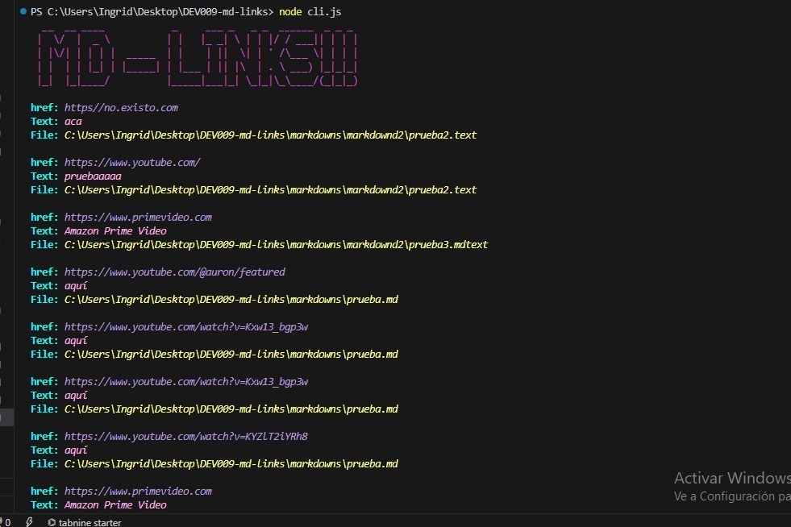
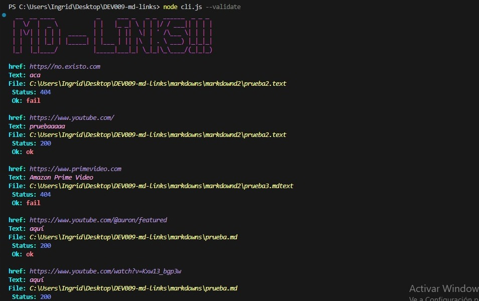
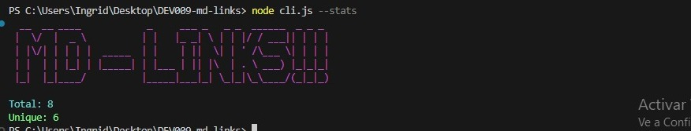
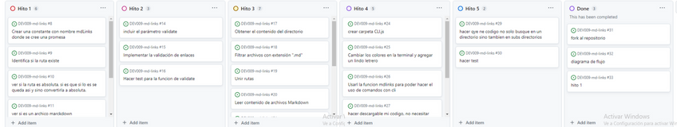
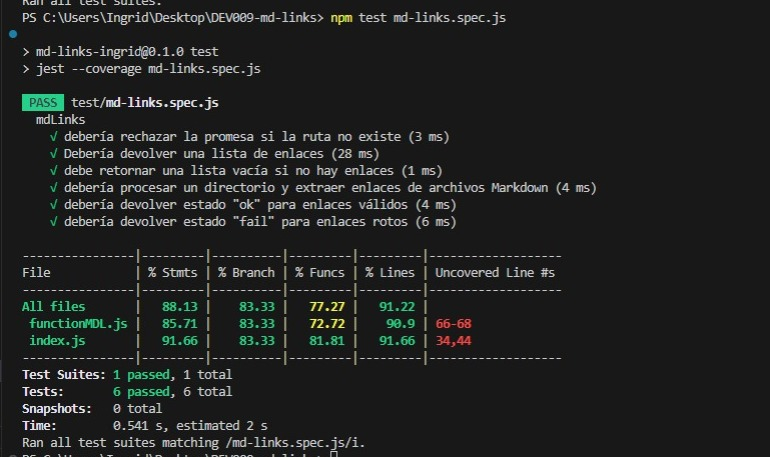

# Markdown Links 🔗

## 1. Introduccion 👋

[Markdown](https://es.wikipedia.org/wiki/Markdown) es un lenguaje de marcado
ligero muy popular entre developers. Es usado en
muchísimas plataformas que manejan texto plano (GitHub, foros, blogs, etc.) y
es muy común encontrar varios archivos en ese formato en cualquier tipo de
repositorio (empezando por el tradicional `README.md`).

Estos archivos `Markdown` normalmente contienen _links_ (vínculos/ligas) que
muchas veces están rotos o ya no son válidos y eso perjudica mucho el valor de
la información que se quiere compartir.

Dentro de una comunidad de código abierto, nos han propuesto crear una
herramienta usando [Node.js](https://nodejs.org/), que lea y analice archivos
en formato `Markdown`, para verificar los links que contengan y reportar
algunas estadísticas.

## 2. Etapas del proyecto➡️

###  Hito 1: Javascript API 💡
En esta primera etapa del proyecto, se crea una función `mdLinks` que funciona como una API de JavaScript. La función retorna una promesa que permite leer archivos Markdown y determinar si contienen enlaces.

#### **Pasos para resolver el HITO 1:**
1. **Creación de una Promesa:** Se implementa una promesa para encapsular la lógica de búsqueda y análisis de enlaces en archivos Markdown.

2. **Transformación de la ruta a absoluta:** Se utiliza el módulo `path` de Node.js para convertir la ruta ingresada (ya sea relativa o absoluta) en una ruta absoluta, lo que facilita la manipulación del archivo.

3. **Comprobación de la existencia de la ruta:** Se verifica que la ruta proporcionada exista en el sistema antes de continuar, evitando errores de archivo no encontrado.

4. **Verificación de que el archivo es Markdown:** Se examina la extensión del archivo para confirmar que es un archivo Markdown válido, utilizando extensiones conocidas como .md, .mkd, .mdwn, etc.

5. **Lectura del contenido del archivo:** Se utiliza el módulo `fs.promises` de Node.js para leer el contenido del archivo Markdown. El contenido se almacena en una variable para su posterior análisis.

6. **Extracción de enlaces:** Se realiza una búsqueda en el contenido del archivo para identificar y extraer los enlaces, que luego se almacenan en un arreglo.

7. **Retorno de resultados:** La función `mdLinks` retorna una promesa que resuelve a un arreglo de objetos, donde cada objeto representa un enlace encontrado. Cada objeto incluye propiedades como `href` (URL), `text` (texto dentro del enlace) y `file` (ruta del archivo donde se encontró el enlace).

### Hito 2: Javascript API con Segundo Parámetro "Validate" 📊

 En el segundo hito del proyecto, se amplía la funcionalidad de la función `mdLinks` al introducir un segundo parámetro opcional llamado `validate`. Este parámetro permite a los usuarios validar los enlaces encontrados en los archivos Markdown.

**Pasos para resolver el HITO 2:**

1. **Agregar el parámetro `validate`:** Modificamos la función `mdLinks` para que pueda aceptar el parámetro opcional `validate`.

2. **Validación de enlaces (cuando `validate` es true):** Implementamos la lógica necesaria para validar los enlaces encontrados en los archivos Markdown. Esto incluye:
   - Realizar solicitudes HTTP a cada enlace.
   - Obtener el código de respuesta HTTP de cada solicitud.
   - Determinar si la solicitud fue exitosa o fallida.
   - Agregar las propiedades `status` y `ok` a los objetos de enlace en el resultado.

3. **Retorno de resultados:** La función `mdLinks` retorna resultados diferentes dependiendo del valor de `validate`:
   - Si `validate` es `false` o `undefined`, retorna un arreglo de objetos que representan los enlaces encontrados, con las propiedades `href`, `text`, y `file`.
   - Si `validate` es `true`, retorna un arreglo de objetos que representan los enlaces encontrados, con las mismas propiedades mencionadas anteriormente, además de `status` y `ok` para cada enlace validado.

Este hito agrega una capa de funcionalidad a la herramienta `mdLinks`, permitiendo a los usuarios verificar la validez de los enlaces en los archivos Markdown. Los detalles de la implementación y ejemplos se pueden encontrar en la documentación y pruebas unitarias correspondientes.

### Hito 3: Buscando dentro de un directorio 🔍

En este tercer hito del proyecto, nuestra función `mdLinks` se vuelve aún más versátil al permitir a los usuarios analizar archivos Markdown dentro de un directorio completo. La función recorrerá todos los archivos existentes en el directorio especificado y extraerá los enlaces de cada archivo `.md` encontrado.

**Pasos para resolver el HITO 3:**

1. **Obtén el contenido del directorio:** Utilizamos la función `readdirSync` del módulo `fs` para obtener una lista de todos los archivos y subdirectorios dentro del directorio proporcionado.

2. **Imprime la lista de archivos en consola:** Para asegurarnos de que estamos obteniendo la lista correcta de archivos y directorios, podemos imprimirla en la consola durante las pruebas.

3. **Une dos rutas:** El módulo `path` de Node.js es esencial aquí. Lo utilizamos para unir segmentos de rutas y obtener rutas completas, lo que facilita el acceso a los archivos y directorios dentro del directorio analizado.

4. **Procesamiento de archivos .md:** Por cada archivo `.md` encontrado en el directorio, realizamos las siguientes acciones:
   - Leemos el contenido del archivo.
   - Extraemos los enlaces del contenido del archivo.
   - Almacenamos los enlaces en un arreglo.

5. **Retorno de resultados:** La función `mdLinks` retorna un arreglo de objetos que representan los enlaces encontrados en todos los archivos `.md` del directorio. Estos objetos tienen las mismas propiedades que en los hitos anteriores (href, text, file).

Este hito amplía la funcionalidad de `mdLinks`, permitiendo a los usuarios analizar y extraer enlaces de múltiples archivos Markdown dentro de un directorio. 

### Hito 4: Interfaz de Línea de Comando (CLI) 🚀

En este cuarto hito del proyecto "Markdown Links," hemos desarrollado una Interfaz de Línea de Comando (CLI) que brinda una forma fácil y versátil de utilizar nuestra herramienta para analizar enlaces en archivos Markdown.

1. Comportamiento por Defecto 
  
   El comportamiento por defecto de la CLI no valida si las URLs responden correctamente o no. En su lugar, identifica el archivo Markdown en función de la ruta proporcionada, analiza el contenido del archivo en busca de enlaces y muestra los enlaces encontrados junto con la ruta del archivo en el que aparecen y el texto dentro del enlace.

   Ejemplo de Ejecución Predeterminada:

   

2. Opciones Disponibles 

   La CLI ofrece opciones adicionales para personalizar el análisis de enlaces:

   ***--validate***
   
   Si se pasa la opción --validate, la CLI realizará solicitudes HTTP para verificar si los enlaces funcionan correctamente. Si un enlace redirige a una URL que responde exitosamente, se considerará "ok".
   
   Ejemplo de Ejecución con --validate:

   

   ***--stats***

   Si se pasa la opción --stats, la CLI mostrará estadísticas básicas sobre los enlaces encontrados. Esto incluye el recuento total de enlaces y el recuento de enlaces únicos.

   Ejemplo de Ejecución con --stats:

   
   
   ***Combinación de Opciones***

   Es posible combinar las opciones --validate y --stats para obtener estadísticas que dependen de los resultados de la validación.

   Ejemplo de Ejecución con --validate y --stats:
   
   

### Hito 5: Buscando dentro de Subdirectorios 📂

En este quinto hito del proyecto "Markdown Links," hemos mejorado la funcionalidad de la función mdLinks(path, validate) para que sea capaz de buscar enlaces en archivos Markdown no solo en el directorio especificado, sino también en todos los subdirectorios que pueda contener.

**Pasos para resolver el HITO 5:**

Objetivo Claro: El objetivo principal de este hito era habilitar la búsqueda de enlaces en subdirectorios, lo que requería una comprensión clara de la necesidad de esta funcionalidad.

1. **Concepto de Recursividad:** Para lograr esta funcionalidad, fue esencial comprender el concepto de recursividad, que nos permitiría explorar subdirectorios de manera eficiente y exhaustiva.

2. **Diseño de la Función mdLinks:** Hemos adaptado la función mdLinks para que sea capaz de manejar tanto archivos individuales como directorios. Esto se logró mediante una implementación que realiza llamadas recursivas cuando se encuentra un directorio.

3. **Casos Base Identificados:** Identificamos casos base importantes, como la búsqueda de enlaces en archivos individuales, lo que evitó que la recursividad se extendiera indefinidamente.

4. **Exploración de Subdirectorios:** Implementamos un mecanismo que nos permite explorar subdirectorios dentro de la ruta proporcionada. Utilizamos las funciones proporcionadas por Node.js para obtener una lista de archivos y directorios en un directorio específico.

5. **Llamadas Recursivas a mdLinks:** Cuando encontramos un directorio, realizamos llamadas recursivas a la función mdLinks, asegurando que todos los niveles de subdirectorios se analicen exhaustivamente.

6. **Combinación de Resultados:** Definimos cómo combinar los resultados de las llamadas recursivas para obtener una lista completa de enlaces de todos los archivos y subdirectorios explorados.

7. **Documentación Actualizada:** Actualizamos la documentación del proyecto para reflejar la nueva capacidad de mdLinks para buscar enlaces en subdirectorios. Proporcionamos ejemplos claros de uso para que los usuarios comprendan cómo aprovechar esta funcionalidad.

8. **Validación Exhaustiva:** Realizamos pruebas exhaustivas con varios directorios y archivos Markdown para garantizar que mdLinks pueda buscar enlaces en todos los niveles de subdirectorios de manera efectiva.

Con estos pasos, hemos logrado con éxito el Hito 5 y hemos mejorado significativamente la capacidad de "Markdown Links" para explorar proyectos con estructuras de carpetas complejas. Esta funcionalidad permitirá a los usuarios obtener un análisis completo de los enlaces en sus proyectos, sin importar cuán profundos sean los subdirectorios.

## 3. Planificación y Organización del Proyecto 📅

El proyecto se desarrolló en cinco hitos, cada uno construyendo sobre el anterior, siguiendo una metodología ágil. Utilizamos **GitHub Projects** para gestionar tareas, lo que facilitó la colaboración y el seguimiento del progreso. Esta planificación estratégica aseguró un flujo de trabajo organizado y eficiente.

A continuación, se muestra una captura de pantalla de nuestro tablero de GitHub Projects, que se utilizó para la planificación y organización del proyecto.

#### Diagrama de Flujo de Desarrollo

Además de utilizar GitHub Projects, creamos un diagrama de flujo que representaba visualmente la evolución del proyecto. Este diagrama se actualizó con cada hito y se convirtió en una herramienta valiosa para visualizar el progreso.

El diagrama de flujo comenzó con una estructura simple y se fue enriqueciendo a medida que agregamos pasos y detalles con cada hito. Esto nos ayudó a mantenernos enfocados en los objetivos y a seguir una secuencia lógica de desarrollo.

## 4. Instalación del paquete

Forma de instalación del paquete usando github.

        npm install github.com/Ingrid1802/DEV009-md-links

   
Forma de instalacion via NPM

        npm i md-links-ingrid

### Uso de la herramienta 

El paquete md-links brinda una eficaz herramienta para explorar archivos Markdown en busca de enlaces y, si es preciso, validarlos. Su versatilidad puede resultar invaluable en una amplia gama de escenarios, ya sea en el ámbito del desarrollo o en la gestión de contenido basado en Markdown.

## 6. Test Unitarios

Manejo de  pruebas unitarias 

 ***Elaborado por Ingrid Aybar - DEV009***
